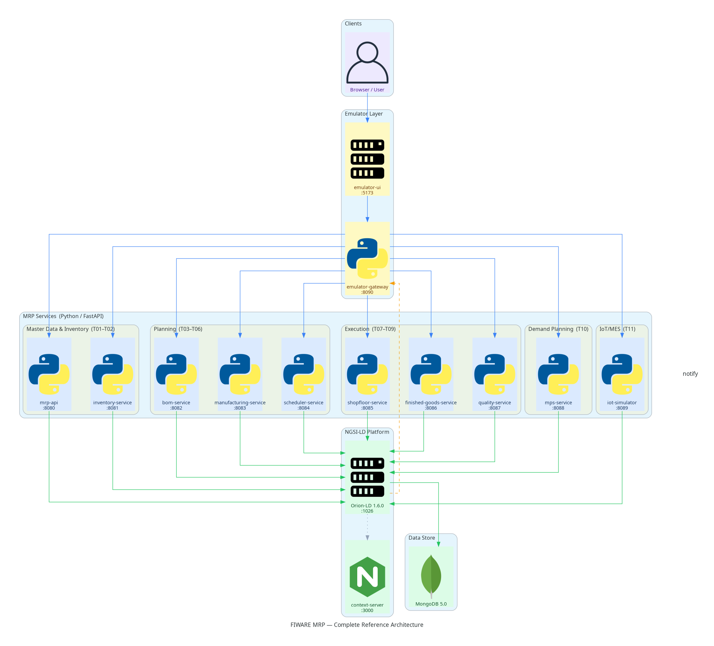
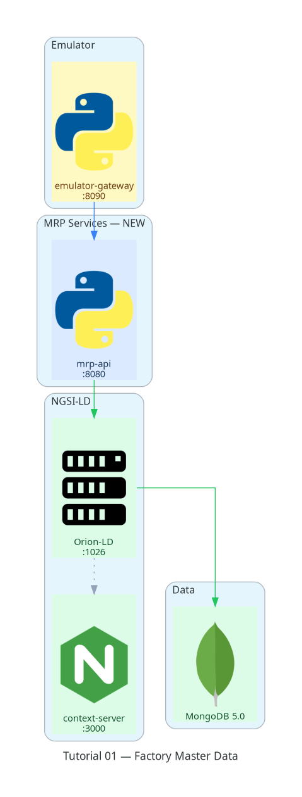
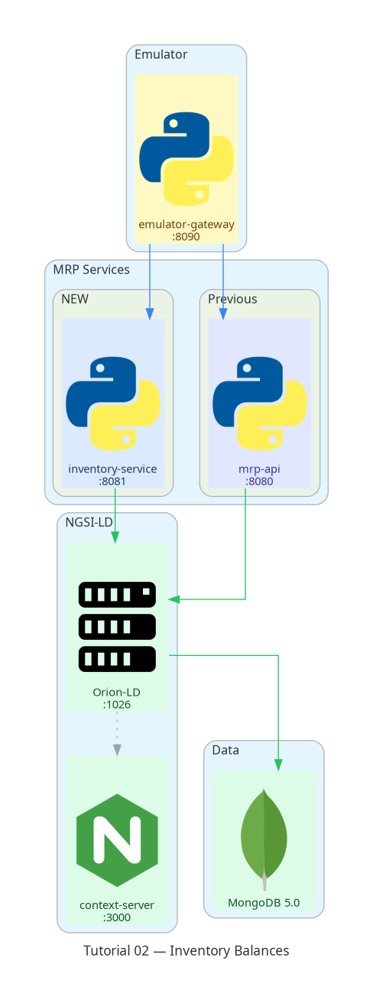
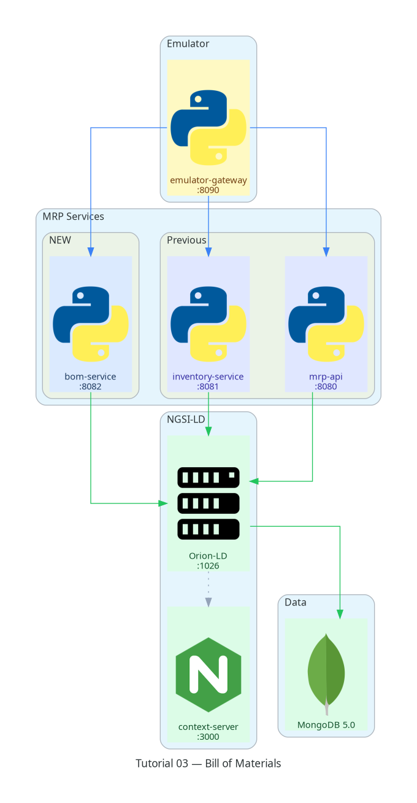
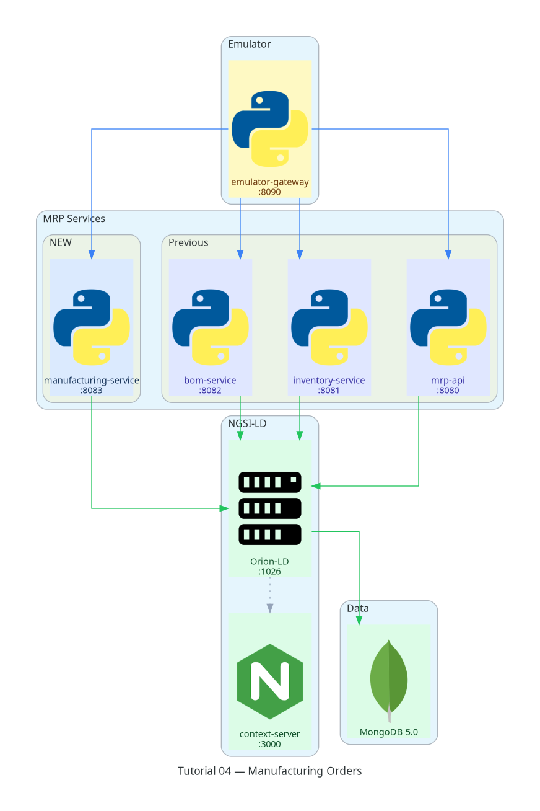
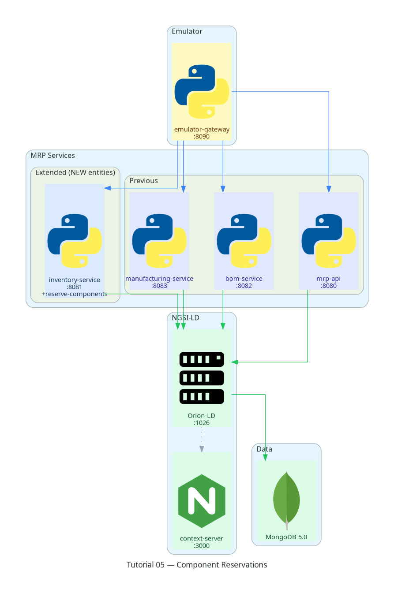
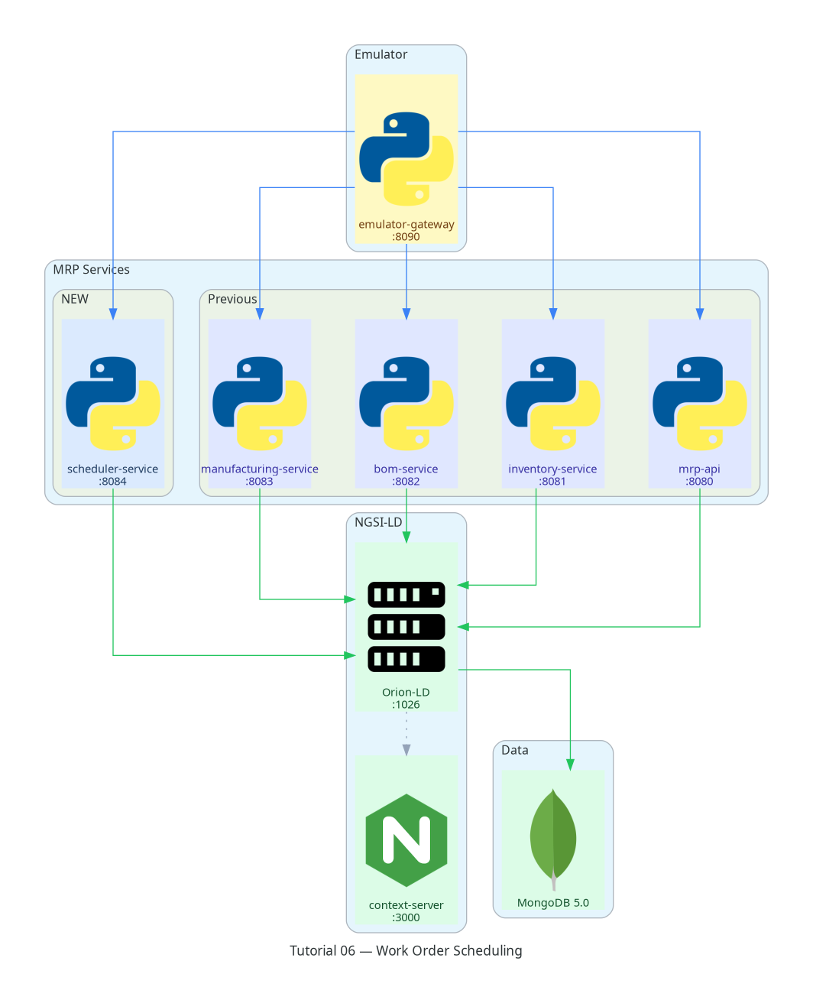
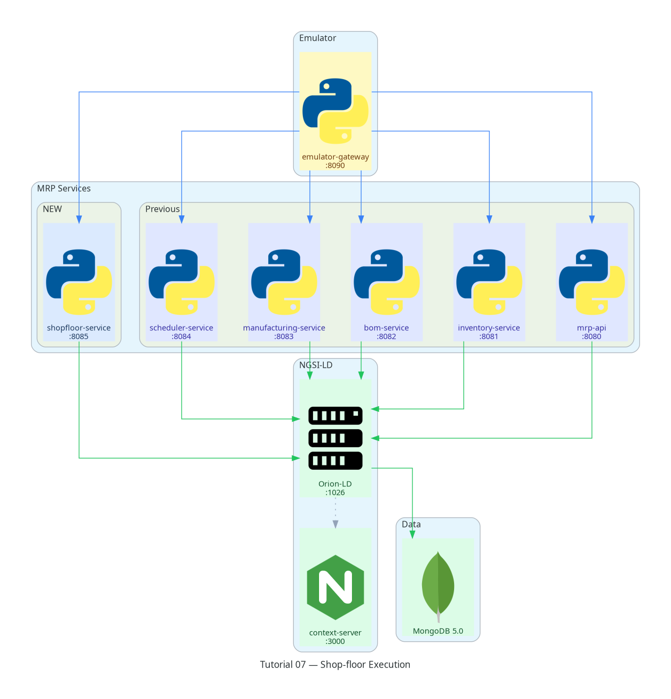
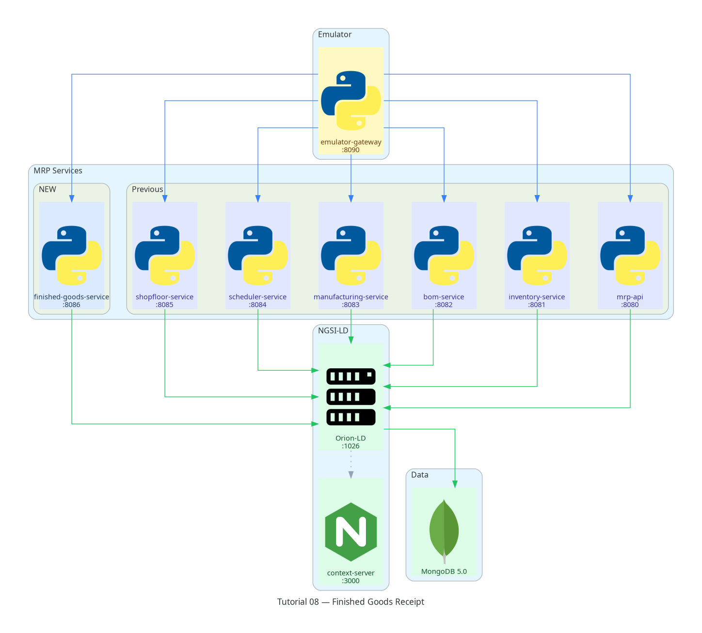
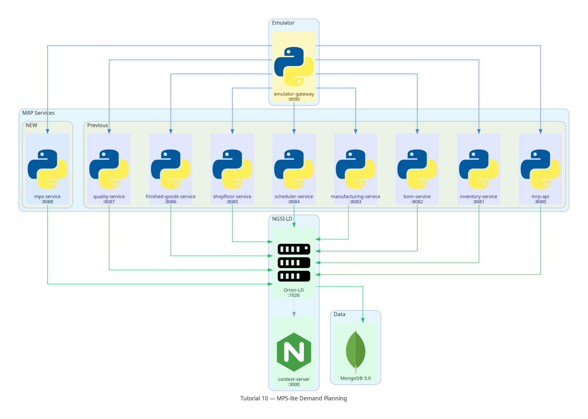

System Architecture
===================

This page describes the complete FIWARE MRP reference architecture as it
will look when all twelve tutorials are finished.  The system is built
around the `NGSI-LD <https://www.etsi.org/deliver/etsi_gs/CIM/001_099/009/01.06.01_60/gs_CIM009v010601p.pdf>`_
standard and the `Orion-LD <https://github.com/FIWARE/context.Orion-LD>`_
context broker.

----

Architectural principles
-------------------------

**NGSI-LD as the integration bus.**
Every microservice reads and writes *only* through Orion-LD.  Services
never call each other directly — the broker is the single source of truth
for all entity state.  This gives every component the same integration
contract regardless of when it was added.

**One microservice per business domain.**
Each FastAPI service owns a single set of entity types and a single set of
commands.  Port allocations are stable and follow the tutorial sequence.

**Context-driven semantics.**
All entity types, relationships, and attributes are defined in the MRP
JSON-LD context served at ``http://context-server:3000/contexts/mrp/v0.1/context.jsonld``.
Adding a new tutorial means extending the context file — never changing
existing terms.

**Incremental delivery.**
The stack grows one service per tutorial.  Earlier tutorials continue to
pass their automated assertions even after later services are added.

----

Component reference
--------------------

.. list-table::
   :header-rows: 1
   :widths: 25 10 15 50

   * - Component
     - Port
     - Tutorial
     - Responsibility
   * - **MongoDB 5.0**
     - internal
     - infrastructure
     - Persistent store for Orion-LD entity data
   * - **Orion-LD 1.6.0**
     - 1026
     - infrastructure
     - NGSI-LD context broker — entity CRUD, subscriptions, batch upsert
   * - **context-server**
     - 3000
     - T01
     - Serves the versioned MRP JSON-LD ``@context`` file
   * - **mrp-api**
     - 8080
     - T01
     - Master data read API — factory, products, work centres
   * - **inventory-service**
     - 8081
     - T02
     - Inventory balances, stock receipts, reservations
   * - **bom-service**
     - 8082
     - T03
     - Bill of Materials management and explosion
   * - **manufacturing-service**
     - 8083
     - T04
     - Manufacturing order confirmation and lifecycle
   * - **scheduler-service**
     - 8084
     - T06
     - Finite-capacity work order generation and scheduling
   * - **shopfloor-service**
     - 8085
     - T07
     - Work order execution — start, complete, production events
   * - **finished-goods-service**
     - 8086
     - T08
     - Finished-goods receipt and inventory update on MO completion
   * - **quality-service**
     - 8087
     - T09
     - Quality inspection, scrap, and rework
   * - **mps-service**
     - 8088
     - T10
     - MPS-lite demand planning
   * - **iot-simulator**
     - 8089
     - T11
     - IoT/MES signal simulation and NGSI-LD subscriptions
   * - **emulator-gateway**
     - 8090
     - emulator
     - WebSocket/SSE hub; step execution engine; mock/live mode
   * - **emulator-ui**
     - 5173
     - emulator
     - Phaser.js factory floor visualisation and guided tutorial checklist

----

Data flow
---------

.. code-block:: text

   Browser
     │
     ▼
   emulator-ui (:5173)
     │  HTTP / SSE
     ▼
   emulator-gateway (:8090)
     │  REST commands        ┌──────────────────────────────────┐
     ├─ mrp-api ────────────►│                                  │
     ├─ inventory-service ──►│   Orion-LD (:1026)               │
     ├─ bom-service ────────►│   NGSI-LD context broker         │
     ├─ manufacturing-service►│   (entity CRUD + subscriptions)  │
     ├─ scheduler-service ──►│                                  │
     ├─ shopfloor-service ──►│                                  │
     ├─ finished-goods-service►│                                │
     ├─ quality-service ─────►│                                │
     ├─ mps-service ─────────►│                                │
     └─ iot-simulator ───────►│                                │
                             └──────────────┬───────────────────┘
                                            │
                                   ┌────────▼────────┐
                                   │  MongoDB 5.0    │
                                   └─────────────────┘

   Since Tutorial 11, Orion-LD also calls emulator-gateway directly:

     Orion-LD (:1026) ── POST /notify (NGSI-LD subscription) ──► emulator-gateway (:8090)

                             ┌─────────────────────────────┐
                             │  context-server (:3000)     │
                             │  JSON-LD @context           │
                             └─────────────────────────────┘
                             (Orion-LD resolves context URIs
                              from this server at startup)

----

NGSI-LD entity types
--------------------

.. list-table::
   :header-rows: 1
   :widths: 30 15 55

   * - Entity type
     - Introduced
     - Description
   * - Company
     - T01
     - Legal entity owning one or more plants
   * - Plant
     - T01
     - Manufacturing facility
   * - WorkCenter
     - T01
     - Logical production resource with capacity
   * - ProductionLine
     - T01
     - Ordered sequence of work centres
   * - Product
     - T01
     - Manufactured, purchased, or consumable item
   * - StockLocation
     - T01
     - Physical or logical inventory location
   * - InventoryBalance
     - T02
     - On-hand quantity of a product at a location
   * - StockMove
     - T02
     - Immutable audit record of an inventory movement
   * - Lot
     - T02
     - Traceable batch of material
   * - BillOfMaterials
     - T03
     - BOM header linking a product to its recipe
   * - BillOfMaterialsLine
     - T03
     - One component line in a BOM
   * - ManufacturingOrder
     - T04
     - Production order with quantity, state, and BoM
   * - InventoryReservation
     - T05
     - Stock commitment per BOM component
   * - WorkOrder
     - T06
     - One routing step: operation, work centre, scheduled times
   * - ProductionEvent
     - T07
     - Immutable record of a work order start or completion
   * - QualityCheck
     - T09
     - Inspection result on a completed WorkOrder
   * - ScrapEvent
     - T09
     - Immutable record of units written off after a failed check
   * - ReworkOrder
     - T09
     - Order to correct units routed back through production
   * - QualityAlert
     - T09
     - Auto-raised when a check's failure rate reaches 20%
   * - DemandForecast
     - T10
     - Forecasted demand for a product over a time bucket
   * - ReorderingRule
     - T10
     - Per-product safety stock, min/max, lot size, and lead time policy
   * - MasterProductionScheduleLine
     - T10
     - Computed projected inventory and suggested production quantity
   * - MachineSignal
     - T11
     - Immutable telemetry reading for a WorkCenter
   * - MachineState
     - T11
     - Derived running/idle/fault state, watched by a live NGSI-LD subscription
   * - OperatorAssignment
     - T11
     - An Operator's clock-in/clock-out record at a WorkCenter

.. note::

   T08 introduces no new entity type — it closes the production loop by
   reusing **StockMove** (``moveType: receipt``) and **InventoryBalance**
   at the finished-goods location, plus a new ``completedAt`` attribute on
   **ManufacturingOrder**.

----

Architecture evolution by tutorial
------------------------------------

Each diagram below shows the incremental addition highlighted in blue.
Infrastructure (green) and previously-introduced services (indigo) are
shown for context.

**Tutorial 01** — Factory master data, JSON-LD context

**Tutorial 02** — Inventory balances and material receipts

**Tutorial 03** — Bill of Materials and BoM explosion

**Tutorial 04** — Manufacturing order confirmation

**Tutorial 05** — Component reservations and shortages

**Tutorial 06** — Work orders and finite-capacity scheduling

**Tutorial 07** — Shop-floor execution and production events

**Tutorial 08** — Finished goods receipt

**Tutorial 09** — Quality inspection, scrap and rework

.. image:: ../_static/architecture/arch-t09.png
   :alt: T09 architecture
   :align: center
   :width: 80%

**Tutorial 10** — MPS-lite demand planning

**Tutorial 11** — IoT/MES signals and subscriptions

.. image:: ../_static/architecture/arch-t11.png
   :alt: T11 architecture
   :align: center
   :width: 80%
