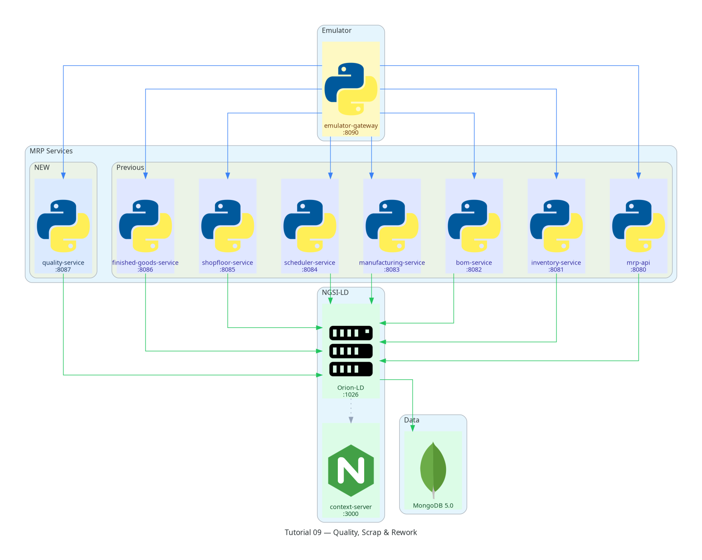

Tutorial 09 — Quality, Scrap & Rework
========================================

**Stack tag:** v0.9  |  **New service:** ``quality-service`` (port 8087)

Business goal
-------------

Not every unit that comes off the line is good. ``quality-service`` lets
the shop floor record inspection results against completed WorkOrders,
decide what happens to failed units — scrap them, rework them, or accept
them as-is — and automatically flags WorkOrders whose reject rate is high
enough to need attention.

What you will build
--------------------

* ``quality-service`` (FastAPI, port 8087) — one command:

  - ``POST /commands/inspect-work-order`` — records a quality check
    against a completed WorkOrder. ``result`` (``pass``/``fail``) is
    derived from comparing ``actual_value`` to ``expected_value`` within
    ``tolerance``. If any units failed, the caller supplies a
    ``disposition`` (``scrap`` | ``rework`` | ``use_as_is``), which
    creates a ``ScrapEvent`` or ``ReworkOrder`` accordingly. If the
    failure rate reaches 20%, a ``QualityAlert`` is raised automatically.

* Four new NGSI-LD entity types:

  - :doc:`QualityCheck <../data-models/quality-check>` — the inspection record
  - :doc:`ScrapEvent <../data-models/scrap-event>` — units written off
  - :doc:`ReworkOrder <../data-models/rework-order>` — units routed back through production
  - :doc:`QualityAlert <../data-models/quality-alert>` — auto-raised on high failure rates

``quality-service`` is additive: it does not block or modify
``finished-goods-service`` from Tutorial 08. In a production deployment
you would typically call it before ``receive-finished-goods``, but the
two services communicate only through the entities they read and write
in Orion-LD — never directly — consistent with every other service in
this stack.

Prerequisites
-------------

Running into trouble? See the :doc:`/troubleshooting` guide.

Tutorials 01–08 delivered and tested.  ``TUTORIAL=09 make seed`` loads
the same 30 entities as Tutorial 08 — MO-2024-001 with all 3 WorkOrders
completed. No new seed entities are needed; QualityCheck, ReworkOrder,
and QualityAlert are all created live by the inspect command.

Quick start
-----------

.. code-block:: bash

   # 1. Start the full stack including quality-service
   make start-emulator          # or: docker compose up -d ... quality-service

   # 2. Seed Tutorial 09 data
   TUTORIAL=09 make seed

   # 3. Inspect the LeakTest work order — 2 of 10 units fail, routed to rework
   curl -s -X POST http://localhost:8087/commands/inspect-work-order \
     -H 'Content-Type: application/json' \
     -d '{
       "work_order_id": "urn:ngsi-ld:WorkOrder:WO-MO-2024-001-LeakTest",
       "check_type": "leak_test",
       "expected_value": 0,
       "actual_value": 0.2,
       "tolerance": 0.1,
       "quantity_inspected": 10,
       "quantity_failed": 2,
       "disposition": "rework",
       "reason_code": "seal_leak"
     }'

   # 4. Inspect the results
   curl -s http://localhost:8087/quality-checks | python3 -m json.tool
   curl -s http://localhost:8087/rework-orders | python3 -m json.tool
   curl -s http://localhost:8087/quality-alerts | python3 -m json.tool

   # 5. Run automated assertions
   make test-09

Automated assertions
---------------------

``make test-09`` runs ``tutorials/09-quality/tests/test-09.sh`` and
verifies ten assertions covering the service health, the inspection
result, the created ReworkOrder and QualityAlert, and the query
endpoints.

NGSI-LD patterns
----------------

Deriving a result instead of trusting the caller
~~~~~~~~~~~~~~~~~~~~~~~~~~~~~~~~~~~~~~~~~~~~~~~~

``result`` is never accepted directly from the request — it is always
computed server-side from ``|actual_value − expected_value| ≤ tolerance``,
so the QualityCheck record can be trusted as an audit trail even if the
caller made an arithmetic mistake describing the measurement:

.. code-block:: python

   result = "pass" if abs(actual_value - expected_value) <= tolerance else "fail"

Branching entity creation on a business decision
~~~~~~~~~~~~~~~~~~~~~~~~~~~~~~~~~~~~~~~~~~~~~~~~

``disposition`` is the pivot for what gets created next — this mirrors
how ``finished-goods-service`` branches on WorkOrder state, but here the
branch point is a value in the request body rather than an entity's
current state:

.. code-block:: text

   quantity_failed > 0 and disposition == "scrap"  → create ScrapEvent
   quantity_failed > 0 and disposition == "rework" → create ReworkOrder
   quantity_failed > 0 and disposition == "use_as_is" → QualityCheck only

Threshold-based automatic alerting
~~~~~~~~~~~~~~~~~~~~~~~~~~~~~~~~~~~

A second, independent rule fires off the same inspection data — the
failure rate, not the disposition — following the same shortage/reserved/
partial threshold pattern used by ``reserve-components`` in Tutorial 05:

.. code-block:: python

   failure_rate = quantity_failed / quantity_inspected
   if failure_rate >= 0.2:
       severity = "critical" if failure_rate >= 0.5 else "high"
       # create QualityAlert

Data model introduced
----------------------

* :doc:`../data-models/quality-check`
* :doc:`../data-models/scrap-event`
* :doc:`../data-models/rework-order`
* :doc:`../data-models/quality-alert`

New context terms: ``quantityInspected``, ``quantityFailed`` (all other
attributes reused from terms already reserved in the v0.1 context).

What's next
-----------

Tutorial 10 introduces **MPS-lite demand planning**: ``mps-service``
turns a demand forecast and a reordering policy into a suggested
production quantity, which a planner reviews and confirms.

----

Architecture snapshot
----------------------

See :doc:`../architecture/index` for the full architecture and all incremental diagrams.
