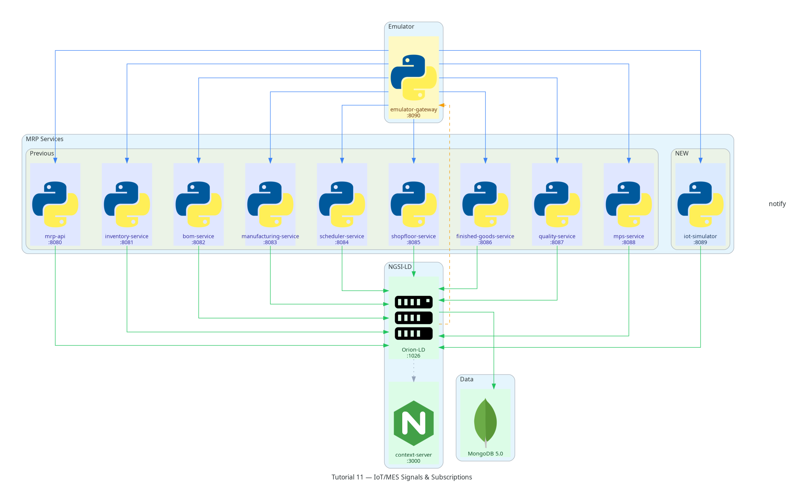

Tutorial 11 — IoT/MES Signals & Subscriptions
=================================================

**Stack tag:** v0.11  |  **New service:** ``iot-simulator`` (port 8089)

Business goal
-------------

Every tutorial so far has pushed updates to the emulator canvas the same
way: a command runs, and the step handler explicitly broadcasts the
result. That works for operator-triggered actions, but it isn't how a
real factory floor behaves — machines report their own status
continuously, and dashboards need to react the moment something changes,
not when someone happens to ask. Tutorial 11 introduces genuine
telemetry and a real NGSI-LD subscription: Orion-LD itself pushes
updates to the emulator, with no polling involved.

What you will build
--------------------

* ``iot-simulator`` (FastAPI, port 8089) — three commands:

  - ``POST /commands/emit-signal`` — records an immutable
    ``MachineSignal`` reading for a WorkCenter, then derives and
    upserts that WorkCenter's ``MachineState`` (``running`` | ``idle``
    | ``fault``) from the signal's quality and value.
  - ``POST /commands/clock-in`` — creates an ``OperatorAssignment``
    with ``timerStatus: clocked_in``.
  - ``POST /commands/clock-out`` — sets ``timerStatus: clocked_out``
    and computes ``actualDuration`` in hours.

* A **live NGSI-LD subscription**, registered directly against
  Orion-LD by the emulator-gateway (not by ``iot-simulator`` — the
  *consumer* of updates owns the subscription, not the producer).
  It filters on ``type: MachineState`` and notifies
  ``emulator-gateway``'s ``/notify`` endpoint. From this tutorial
  onward, MachineState changes reach the canvas because Orion-LD POSTs
  them there — the emulator never asks.

* Three new NGSI-LD entity types:

  - :doc:`MachineSignal <../data-models/machine-signal>` — immutable telemetry
  - :doc:`MachineState <../data-models/machine-state>` — derived per-WorkCenter state
  - :doc:`OperatorAssignment <../data-models/operator-assignment>` — clock-in/out record

* One new master-data entity: **Operator** (reserved since Tutorial 01
  but unused until now) — seeded as Jane Doe.

Scope note: temporal data
---------------------------

The v0.11 roadmap line originally read "IoT/MES signals, subscriptions
*and temporal data*." NGSI-LD's full Temporal API (``/temporal/entities``)
requires a separate component — Orion-LD delegates it to
`Mintaka <https://github.com/FIWARE/mintaka>`_ — which this stack does
not run. Rather than add that infrastructure for one tutorial, Tutorial
11 covers temporal data the NGSI-LD-native way that needs no extra
component: every ``MachineSignal.actualValue`` carries an
``observedAt`` timestamp, the standard Property-level metadata for
"when was this value true," independent of when the entity was written.

Prerequisites
-------------

Running into trouble? See the :doc:`/troubleshooting` guide.

Tutorials 01–10 delivered and tested. ``TUTORIAL=11 make seed`` loads
34 entities: Tutorial 10's 33 entities, plus an Operator (Jane Doe,
active). MachineSignal, MachineState, and OperatorAssignment are all
created live by commands — none are pre-seeded.

Quick start
-----------

.. code-block:: bash

   # 1. Start the full stack including iot-simulator
   make start-emulator          # or: docker compose up -d ... iot-simulator

   # 2. Seed Tutorial 11 data
   TUTORIAL=11 make seed

   # 3. Register a subscription — Orion-LD will now push MachineState changes
   curl -s -X POST http://localhost:1026/ngsi-ld/v1/subscriptions \
     -H 'Content-Type: application/ld+json' \
     -H 'Link: <http://localhost:3000/contexts/mrp/v0.1/context.jsonld>; rel="http://www.w3.org/ns/json-ld#context"; type="application/ld+json"' \
     -d '{
       "type": "Subscription",
       "entities": [{"type": "MachineState"}],
       "notification": {"endpoint": {"uri": "http://emulator-gateway:8090/notify", "accept": "application/json"}}
     }'

   # 4. Emit a signal: Assembly overheats
   curl -s -X POST http://localhost:8089/commands/emit-signal \
     -H 'Content-Type: application/json' \
     -d '{"work_center_id": "urn:ngsi-ld:WorkCenter:WC-Assembly", "signal_type": "temperature", "actual_value": 92, "unit_code": "CEL", "quality": "bad"}'

   # 5. Clock an operator in and out
   curl -s -X POST http://localhost:8089/commands/clock-in \
     -H 'Content-Type: application/json' \
     -d '{"operator_id": "urn:ngsi-ld:Operator:OP-JaneDoe", "work_center_id": "urn:ngsi-ld:WorkCenter:WC-Assembly"}'
   # (use the returned assignment_id)
   curl -s -X POST http://localhost:8089/commands/clock-out \
     -H 'Content-Type: application/json' \
     -d '{"assignment_id": "<assignment_id>"}'

   # 6. Run automated assertions
   make test-11

Automated assertions
---------------------

``make test-11`` runs ``tutorials/11-iot-mes/tests/test-11.sh`` and
verifies eleven assertions covering signal emission, state derivation
(and that repeated signals overwrite rather than duplicate
MachineState), clock-in/out, and both query endpoints. The live
subscription push itself is demonstrated in the emulator UI and
verified manually rather than in the automated suite — asserting on an
asynchronous webhook delivery from bash is more trouble than it is
worth for a tutorial test.

NGSI-LD patterns
----------------

Context-type conflict on subscription creation
~~~~~~~~~~~~~~~~~~~~~~~~~~~~~~~~~~~~~~~~~~~~~~~

Orion-LD rejects ``POST /subscriptions`` with both a ``Content-Type:
application/ld+json`` header and a ``Link`` header — the two are
mutually exclusive context-resolution mechanisms and combining them is
a ``400 BadRequestData`` ("invalid combination of HTTP headers
Content-Type and Link"). This differs from ``GET`` requests elsewhere in
this stack, which pair ``Accept: application/ld+json`` with a ``Link``
header without any conflict. The fix is the same one every entity write
in this codebase already uses: put ``@context`` inline in the body and
drop the ``Link`` header entirely.

Subscriptions are registered by the consumer, not the producer
~~~~~~~~~~~~~~~~~~~~~~~~~~~~~~~~~~~~~~~~~~~~~~~~~~~~~~~~~~~~~~~

``iot-simulator`` never calls Orion-LD's ``/subscriptions`` endpoint —
it only ever reads and writes its own entity types, the same as every
other service in this stack. The subscription is created by
``emulator-gateway``, because *it* is the one that wants to be notified:

.. code-block:: text

   POST /ngsi-ld/v1/subscriptions

   {
     "type": "Subscription",
     "entities": [{ "type": "MachineState" }],
     "notification": {
       "endpoint": { "uri": "http://emulator-gateway:8090/notify", "accept": "application/json" }
     }
   }

Overwrite, don't append, for derived state
~~~~~~~~~~~~~~~~~~~~~~~~~~~~~~~~~~~~~~~~~~~

``MachineSignal`` readings are immutable and accumulate — every
emission creates a new one. ``MachineState`` is the opposite: exactly
one entity per WorkCenter, upserted every time. ``emit-signal`` follows
the same create-or-update pattern as ``inventory-service`` in Tutorial
02 and ``finished-goods-service`` in Tutorial 08 — ``GET`` by the
deterministic ID; ``PATCH`` if found (``state``, ``detectedAt``, and
``lastSignal`` all already exist after the first write), ``POST`` a new
entity otherwise.

Temporal metadata on a Property
~~~~~~~~~~~~~~~~~~~~~~~~~~~~~~~~

``observedAt`` sits inside the ``actualValue`` Property, not as a
top-level attribute — this is how NGSI-LD timestamps *when a value was
true*, separate from when Orion-LD received the write:

.. code-block:: json

   "actualValue": { "type": "Property", "value": 92.0, "unitCode": "CEL", "observedAt": "2024-07-01T09:15:00Z" }

Data model introduced
----------------------

* :doc:`../data-models/machine-signal`
* :doc:`../data-models/machine-state`
* :doc:`../data-models/operator-assignment`

No new context terms — ``signalType``, ``quality``, ``timerStatus``,
``actualDuration``, ``actualStart``, ``actualEnd``, ``state``, and
``detectedAt`` were all already reserved in the v0.1 context.

What's next
-----------

Tutorial 12 closes the series with an **end-to-end demo**: driving every
tutorial's commands in sequence against a single running stack, and the
v1.0 release.

----

Architecture snapshot
----------------------

See :doc:`../architecture/index` for the full architecture and all incremental diagrams.
