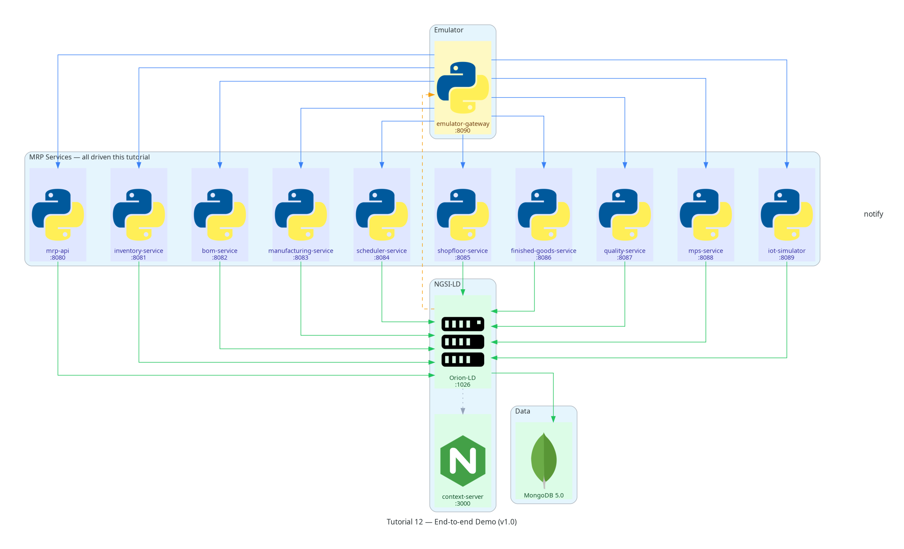

Tutorial 12 — End-to-end Demo (v1.0)
=================================================

**Stack tag:** v0.12  |  **New service:** none — this tutorial closes the series

Business goal
-------------

Eleven tutorials have each proven one slice of the pipeline in isolation:
inventory, BoM explosion, order confirmation, reservations, scheduling,
shop-floor execution, finished-goods receipt, quality, demand planning,
and IoT telemetry. Tutorial 12 asks a different question: does the whole
thing actually work *together*, as one continuous run, against real
services and a real broker? It introduces no new service and no new
entity type — it drives every command from Tutorials 02 through 11 once,
in sequence, against a single fresh ManufacturingOrder, and asserts the
resulting graph is coherent end to end. This is the release tutorial:
if it passes, the reference implementation is v1.0.

What you will build
--------------------

Nothing new. The story this tutorial tells:

1. **Plan** — explode a BoM to preview material requirements
   (:doc:`Tutorial 03 <03-bom>`), receive more raw material
   (:doc:`Tutorial 02 <02-inventory>`), then turn a demand forecast into
   an MPS suggestion (:doc:`Tutorial 10 <10-mps>`).
2. **Execute** — confirm the resulting ManufacturingOrder
   (:doc:`Tutorial 04 <04-manufacturing-orders>`), reserve its components
   (:doc:`Tutorial 05 <05-reservations>`), schedule its work orders
   (:doc:`Tutorial 06 <06-work-orders>`), and run them on the shop floor
   (:doc:`Tutorial 07 <07-shop-floor>`) with a live IoT machine signal and
   an operator clock-in/out (:doc:`Tutorial 11 <11-iot-mes>`).
3. **Close the loop** — inspect the finished work for quality
   (:doc:`Tutorial 09 <09-quality>`), receive the finished goods into
   stock (:doc:`Tutorial 08 <08-finished-goods>`), and verify the whole
   graph — forecast, MO, reservations, work orders, machine state,
   operator assignment, quality check, and finished-goods stock — from a
   single query.

Scope note: no new service
---------------------------

The v0.12 roadmap line reads "end-to-end demo and v1.0 release." Every
service this tutorial calls already exists; the only new artifact is a
fresh, self-contained seed (``tutorial-12.json``, 27 entities) that seeds
a *draft* ManufacturingOrder rather than one already mid-lifecycle —
because unlike Tutorials 02-11, which each seed the *cumulative* state
left behind by every prior tutorial's own demo, Tutorial 12 needs a
ManufacturingOrder that hasn't been touched yet, so every command in the
walkthrough runs for the first time.

Prerequisites
-------------

Running into trouble? See the :doc:`/troubleshooting` guide.

Tutorials 01-11 delivered and tested. ``TUTORIAL=12 make seed`` loads 27
entities: Tutorial 01 master data, the Tutorial 03 BoM, unreserved
component ``InventoryBalance`` entities, a ``DemandForecast`` +
``ReorderingRule`` for the MPS step, a **draft** ``ManufacturingOrder``
(``MO-2024-002``), and the Operator from Tutorial 11.

Quick start
-----------

.. code-block:: bash

   # 1. Start the full stack
   make start-emulator

   # 2. Seed Tutorial 12 data and run the full sequence + assertions
   make test-12

``make test-12`` re-seeds automatically, so it is always safe to re-run
from a clean stack. Running ``tutorials/12-end-to-end/tests/test-12.sh``
directly, twice, without reseeding in between will fail partway through:
``MO-2024-002`` only has one lifecycle to walk, and a couple of the
commands it drives (``ProductionEvent`` creation, ``WorkOrder`` state
guards) are intentionally not idempotent against already-completed
state — see :doc:`../tutorials/12-end-to-end` (this page) or the
``tutorials/12-end-to-end/README.md`` walkthrough for the full command
sequence.

Automated assertions
---------------------

``make test-12`` runs ``tutorials/12-end-to-end/tests/test-12.sh`` and
verifies 32 assertions spanning all nine services introduced across
Tutorials 02-11: health checks, BoM explosion, material receipt, MPS
generation and confirmation, order confirmation, component reservation,
work-order scheduling, shop-floor execution with a live machine signal
and operator clock-in/out, quality inspection, finished-goods receipt,
and a final broker-side verification of the completed graph.

NGSI-LD patterns
------------------

Upsert is not idempotent against already-completed state
~~~~~~~~~~~~~~~~~~~~~~~~~~~~~~~~~~~~~~~~~~~~~~~~~~~~~~~~~

Re-running this tutorial's commands against the *same* entities without
reseeding surfaces a subtlety worth knowing: Orion-LD's batch
``POST /entityOperations/upsert`` does not silently reset an existing
entity's attribute values back to what a fresh payload specifies — a
``WorkOrder`` already ``completed`` from a prior run stays
``completed`` even after ``create-work-orders`` re-upserts it as
``planned``, since the service only guards on the *current* live state,
not on what the seed just claimed. Combined with ``ProductionEvent``'s
deterministic, create-only IDs (a second ``POST /entities`` for the same
ID returns ``409``), replaying this tutorial's exact sequence against a
broker that already ran it once will fail at ``start-work-order`` with
*"WorkOrder must be in planned state, got: completed."* The fix in
practice is simply what ``make test-12`` already does automatically:
reseed (or ``make reset``) before every run. This is not a defect in any
individual command — each one behaves correctly in isolation — it is a
property of chaining stateful commands against a broker that remembers
everything.

One continuous graph, not eleven disconnected demos
~~~~~~~~~~~~~~~~~~~~~~~~~~~~~~~~~~~~~~~~~~~~~~~~~~~~

Every earlier tutorial's seed file bundles the *cumulative* entities left
behind by every prior tutorial's own demo — a convenience that lets each
tutorial be tested independently, but one that also means no single test
run ever exercises a ManufacturingOrder's full, real lifecycle end to
end. Tutorial 12's seed deliberately breaks that pattern: it is the only
seed file in the whole series whose ``ManufacturingOrder`` starts in
``draft`` state, specifically so that this tutorial can drive it through
every transition for the first time, in one run, and prove the graph
connects: ``DemandForecast`` → ``MasterProductionScheduleLine`` →
``ManufacturingOrder`` → ``InventoryReservation`` → ``WorkOrder`` →
``MachineSignal``/``MachineState``/``OperatorAssignment`` →
``QualityCheck`` → ``StockMove``/``InventoryBalance``.

Data model introduced
----------------------

None. Every entity type this tutorial touches was introduced in an
earlier tutorial — see the :doc:`../architecture/index` entity catalogue
for the complete list.

What's next
-----------

Nothing — this is the last tutorial. See the top-level
`README <https://github.com/FcoMelendez/fiware-mrp#readme>`_ for the v1.0
release summary.

----

Architecture snapshot
----------------------

No new service — every component from Tutorials 01-11 is driven once, in
sequence. See :doc:`../architecture/index` for the full, final reference
architecture.
